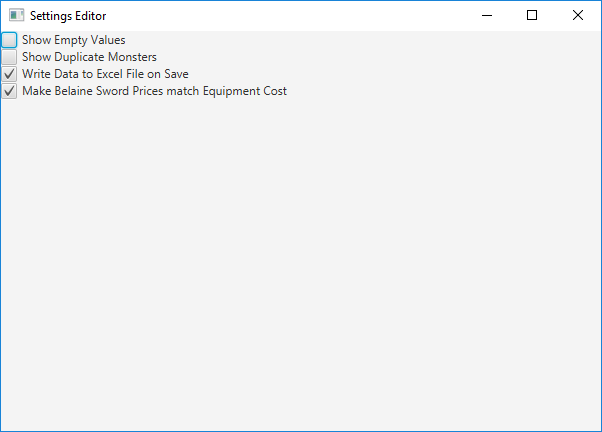

# 7th-Saga-Editor

This program is for editing data tables in a ROM of the Super Nintendo game the 7th Saga to make modifying the game as easy as possible. It allows the user to modify data on characters, spells, equipment, monsters, etc. 

## How to use

Run the file 7th-Saga-Editor.jar found in the executable folder.

## Table of Contents

1. [Character Editor](#character-editor) | [Experience Editor. ](#experience-editor)
2. [Apprentice Editor](#apprentice-editor) 
3. [Spell Editor](#spell-editor) 
4. [Item Editor](#item-editor) | [Weapon Editor](#weapon-editor) | [Armor Editor](#armor-editor)
5. [Shop Editor](#shop-editor) 
6. [Monster Editor](#monster-editor) | [Drop Table Editor](#drop-table-editor)
7. [Text Editor](#text-editor) 
8. [Settings](#settings) 
9. [Known Issues](#known-issues)                            

### Main Menu

The Main Menu is the first thing that loads on startup. Only two buttons are initially available, Open ROM and Settings. Open ROM creates a dialog that allows the user to select which ROM they want to modify. Once a ROM is chosen, the remaining buttons (which open their respective editors), become activated. Each editor displays the current values in the ROM, as well as the values in the original ROM to give the user a frame of reference for their changes.

### Character Editor

This editor modifies data for each of the games seven characters.

### Experience Editor

The experince table in the game is hard coded for each level. Modifying each level individually is time consuming, so this editor allows the user to use a mathmatical formula to quickly and easily change the experience for each level all at once.

### Apprentice Editor

In the game, the player chooses one of seven characters and can interact with the other six throughout the course of the game. When spoken to the other characters can join you, fight you, or say nothing of consequence. This editor controls the probabilities of what they say when spoken to, and the equipment they have when they join/fight you. 

### Spell Editor

This editor modifies the Spell Table.

### Item Editor

This editor modifies the Item Table

### Weapon Editor

This editor modifies the weapon table. To show weapons for a particular character, select that character in the combobox on the right.

### Armor Editor

This editor modifies the armor table. There are two types of armor: body armor, and accessories. Each has their own combobox. The combobox being used has a blue border around it. To show armors for a particular character, select that character in the combobox on the right.

### Shop Editor

This editor modifies what items each shop sells. The order of the shops in the table is not intuitive, so the shops are sorted in chronological order by default. The items, weapons, and armor each shop sells can be sorted by cost.

### Monster Editor

This editor modifies the data for each monster in the game. They are sorted chronologically by default. In the original game, the magic and speed stats are capped at 255. However, I made a patch for the game that makes them capped at 999. This editor automatically detects if the patch is in the game, and sets the cap accordingly.

### Drop Table Editor

Each Monster has a byte which determines which drop table to use to decide what items they drop when defeated. Each entry in the drop table has a 1/16 chance of being chosen. This editor allows the user to choose what items are in each drop table.

### Text Editor

This complex editor is used to find and alter the games text. It is divided into the following sections:

**Text Reader**
This component has two uses. The first textbox allows the user to type a hex address and read whatever text is at that location in the ROM. The second textbox allows the user to type in text so that they can locate where it is in the game. When the Generate Results button is clicked, the text will be converted into bytes, and the entire ROM will be searched for a match. Any locations that match the text are displayed along with any pointers to those locations.

**Text Writer**
This component allows the user to type in text and a location in the ROM and have that text be written there.

**Pointer Writer**
This component allows the user to overwrite a text pointer at a given location in the ROM.

**Text Mover**
This component allows the user to move text from one location in the ROM to another. Each byte of text in the old location is replaced with the value 0xFF to mark it as free space. When doing this, it is essential to use the pointer writer to update the pointer for that text with its new location.

### Settings

The settings displayed here are a series of check boxes that modify how the editor functions. The settings are saved in a file name Settings.data. It is created in the same directory as the application every time the user closes the settings window. The following options are available:

**Show Empty Values**
A lot of entries in the games tables are empty. This option allows the user to choose whether to display these empty entries in the editor. The default value is False.

**Show Duplicate Monsters**
Some monsters in the game have multiple copies in the monster table. If the option is selected, these duplicate copies of monsters will be displayed and can be modified individually. If the option is not selected, only one copy of each monster will be shown in the monster editor, and changes to one monster will be applied to all of its duplicates in the monster table. The default value is False.

**Write Data to Excel File on Save**
If the option is selected, data from each supported table will be put into an Excel file showing its default values, and what they were changed to. The Excel files will be put in the following directory: Program Directory/ChangeLists/ROM Name. The default value is True.

**Make Belaine Sword Prices Match Equipment Cost**
In the Town of Belaine, there are some blacksmiths who sell swords to the player at prices different from their value in the weapon table. If this option is selected, the swords sold by those blacksmiths will have their prices set according to the equipment table. The default value is True.

### Known issues
Opening one ROM and then another will lead to data corruption, if data is saved.
